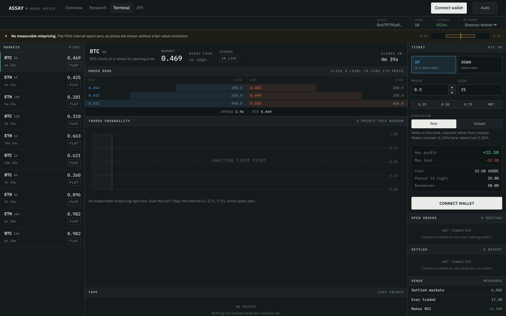
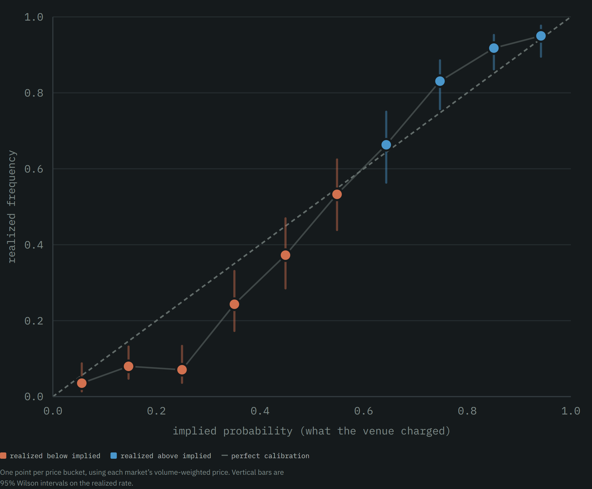
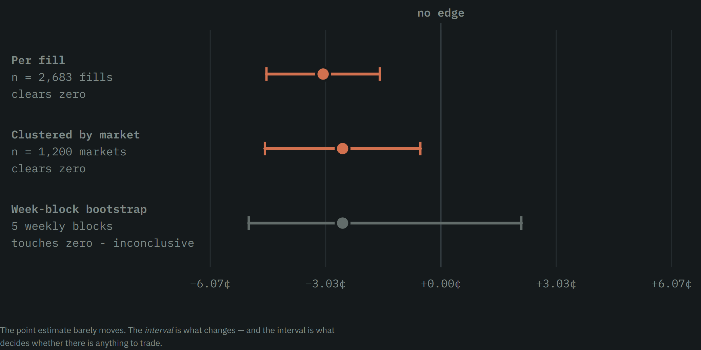
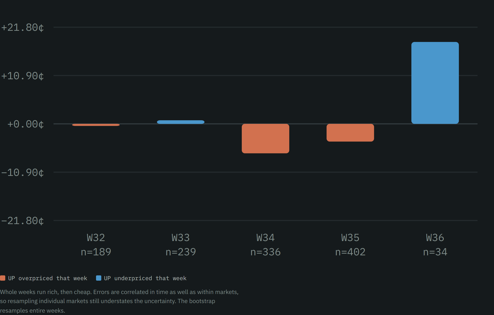
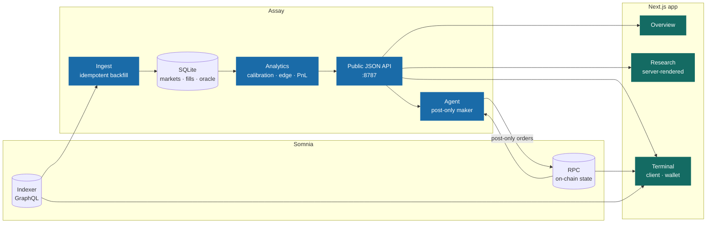
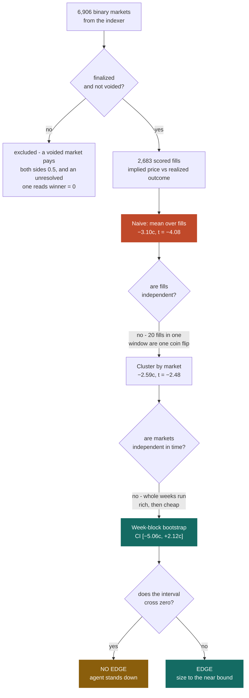
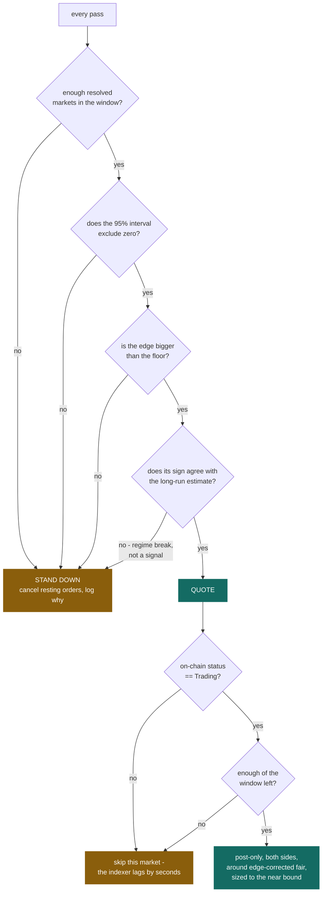
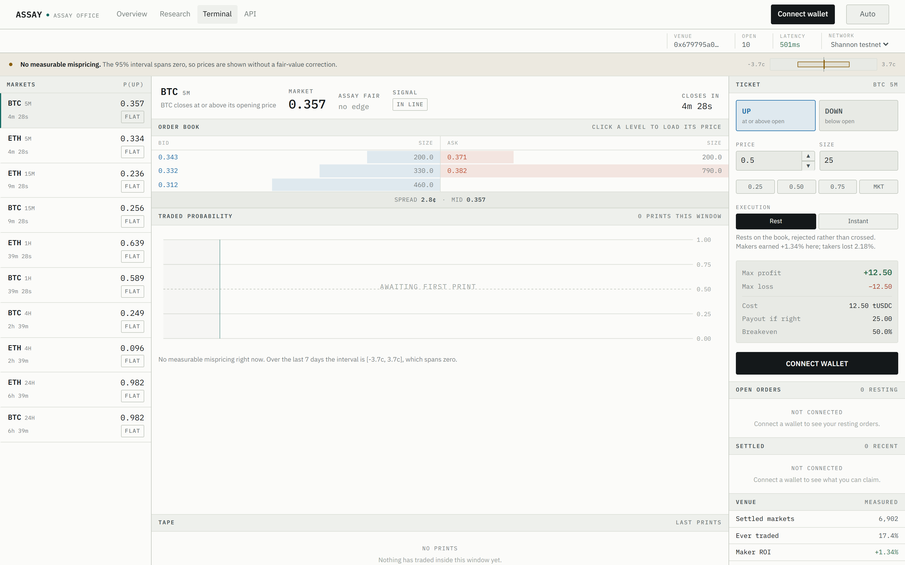
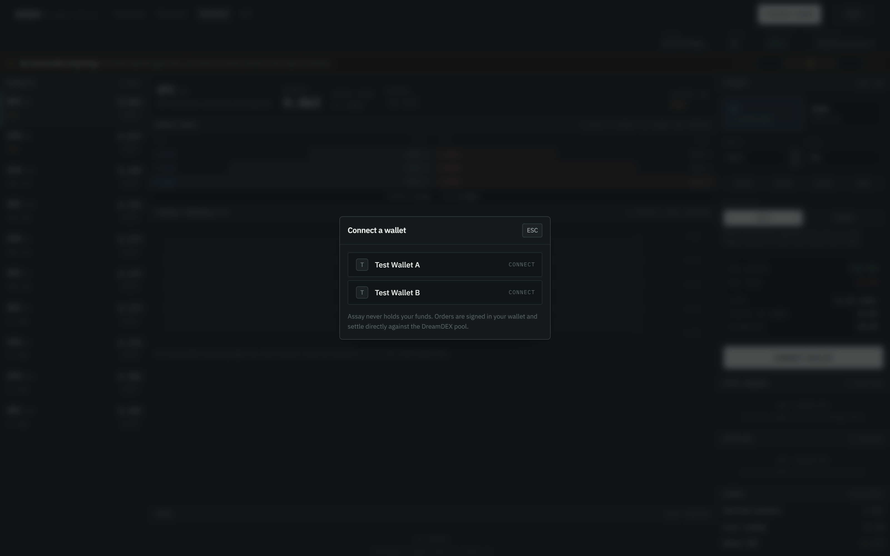
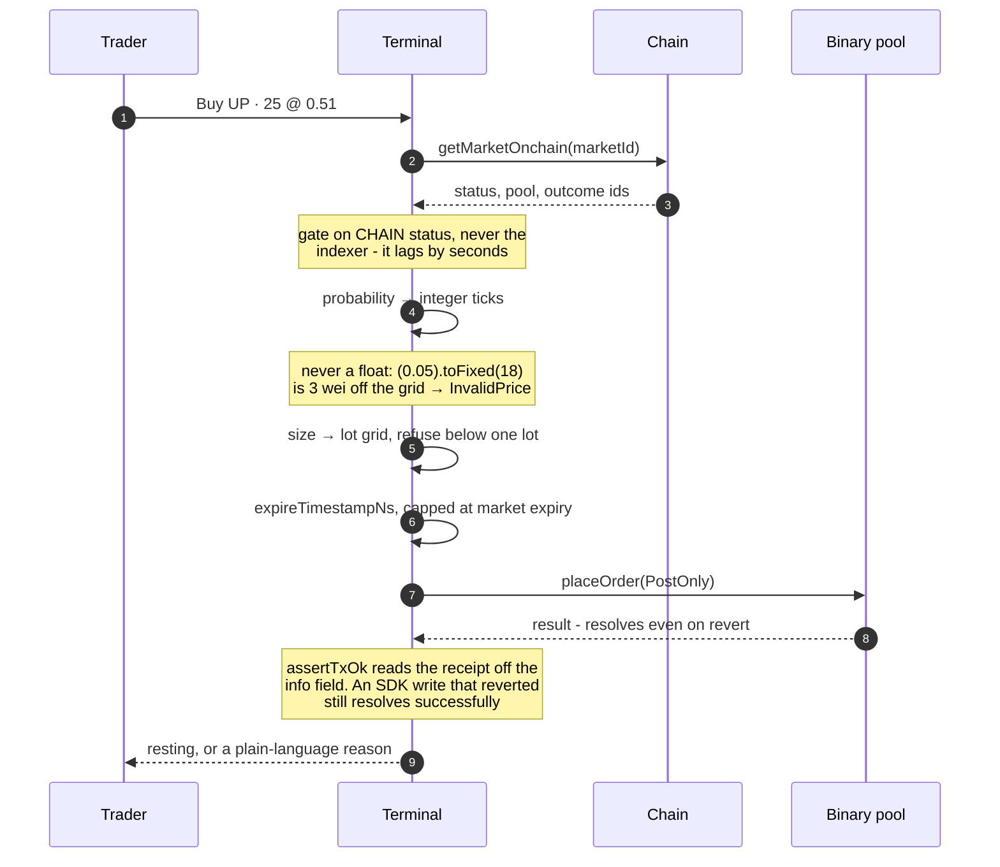

<div align="center">

# Assay

**An assay office for prediction market prices.**

We take DreamDEX event-contract prices, test what they are actually made of, and publish the result -
as an API, a research site, a trading terminal, and an agent that only trades when the assay says
there is something there.

Built for the [Somnia × DreamDEX Event Contracts Hackathon](https://dorahacks.io/hackathon/event-contracts/detail)

[DreamDEX docs](https://docs.dreamdex.io/developers/event-contracts) · [Somnia](https://somnia.network) · [MIT licensed](LICENSE)

</div>



---

## The question

DreamDEX settles a BTC and an ETH event contract every 15 minutes. That cadence makes something
possible that no other prediction market can do: you can measure whether the venue's prices are
*actually calibrated*, continuously, across thousands of resolved outcomes. A Polymarket question
resolves in months, so its calibration curve is a lifetime project. Here it is a live instrument.

So we asked the obvious question - **when this venue says 70%, does it happen 70% of the time?** -
and then refused to stop at the first answer.

---

## What we found

Measured on **6,906 binary markets** from the mainnet venue `0x458b30c2…`, of which 6,902 resolved
and 1,200 traded, carrying 2,683 fills.

### 1. The underlying is a coin flip

The window closed up **50.58%** of the time, 95% CI **[49.40%, 51.76%]** - indistinguishable from
50%, and consistent across both assets and both cadences. There is no drift to harvest, so any edge
has to come from the *price* being wrong.

### 2. Prices are informative, but miscalibrated

Brier skill of **0.474** against an always-50% forecaster, so the prices carry real information.
But the calibration curve bends away from the diagonal at both ends.



### 3. Most of that curve is the clock, not skill

Scoring a market by its volume-weighted price mixes trades from its whole life together, including
ones placed seconds before expiry when the outcome is nearly decided. Score each fill separately by
how much of the window remained and the dramatic S-curve flattens out. **This check is the
difference between a real finding and an artifact of aggregation.**

### 4. The edge is real but *not constant* - and that is the actual result



| Estimator | Mean error | 95% interval | Reading |
|---|---:|---:|---|
| Per fill (naive) | −3.10¢ | [−4.59¢, −1.61¢] | t = −4.08 · "obviously real" |
| Clustered by market | −2.59¢ | [−4.63¢, −0.54¢] | t = −2.48 · worth a look |
| Week-block bootstrap | −2.59¢ | **[−5.06¢, +2.12¢]** | **straddles zero** |

The naive estimate counts 2,683 fills as independent observations when they are really 1,200 coin
flips - every fill inside one window shares a single outcome. That alone moves the t-statistic from
−4.08 to −2.48. And the errors are correlated in *time* as well:



Weekly means run −0.5¢, +0.8¢, −6.6¢, −4.0¢, +18.5¢. **They change sign.** Resample whole weeks and
the interval covers zero.

> **A bot that hard-codes "always fade UP" is fitting last month's weather.** What the data supports
> is measuring the edge continuously and standing down when it is not there.

### 5. Most markets never trade at all

Only **17.4%** of settled markets saw a single trade. The venue's bottleneck is emptiness, not
signal quality - which is why the agent's job is to *provide* liquidity, not take it.

### 6. Makers get paid, takers do not

Settled PnL splits **+1.34% ROI** to the passive side and **−2.18%** to the aggressive side, on a
venue that charges zero fees. So every order this project places is post-only.

---

## How it fits together



The measurement engine is the spine. The web app and the agent consume the same numbers, so they
cannot disagree about what the edge currently is. The research pages are rendered on the server,
which puts the finding in the HTML rather than painting it in after a spinner.

---

## The measurement pipeline

Every interval this project reports is computed this way. The three stages exist because the first
two are each wrong on their own.



---

## What the agent does about it

Its default state is **flat**. All four conditions must hold before it quotes anything.



Condition 4 is the one that matters. Condition 2 alone fires by chance about one window in twenty;
requiring the long-run estimate to point the same way is what separates a regime from a run of luck,
and it is what would have kept the agent flat through week 33 when the weekly mean briefly flipped.

---

## The web app

A Next.js 15 application on the App Router, four routes sharing one design system.

| Route | What it is |
|---|---|
| `/` | Overview, with the live verdict rendered server-side |
| `/research` | The full finding: base rate, calibration curve, three estimators, weekly sign flips, coverage, concentration, leaderboard |
| `/terminal` | The trading client |
| `/api-docs` | The public API surface, with a live example response |

`/`, `/research` and `/api-docs` are **server components**: they fetch the measurement on the server
and ship it inside the HTML, revalidating every 60 seconds. Only `/terminal` runs on the client,
because it holds a wallet and reads live chain state. Theme resolves before first paint via a small
inline script, so navigating never flashes the wrong one.

### The terminal

A trading client that puts the measurement next to the money. Connect a wallet, browse the
open windows with live countdowns and books, and trade - with Assay's fair value and a
**RICH / CHEAP / IN LINE** badge beside every price.





### The wallet layer

Connection is built on **EIP-6963**, not `window.ethereum`. That distinction is
invisible until it bites: with two extensions installed they race to own that property, so a user
with Rabby and MetaMask gets whichever injected last, with no way to choose. EIP-6963 has each
wallet announce itself with its own provider, name and icon, and the page picks.

| | |
|---|---|
| **Wallet picker** | Lists what actually announced, so an unknown wallet works with no code change |
| **Balances** | Collateral and gas, always visible, with a warning before low gas causes a revert rather than after |
| **Positions** | Outcome-token holdings, in the account menu |
| **Open orders** | With cancel. A resting order holds escrow, so an interface that hides it hides your money |
| **Faucet** | 1,000 test collateral on testnet only, because mainnet USDso has no faucet and the button would be a lie |
| **Disconnect** | Scoped honestly: a dapp cannot revoke its own permission, so this stops the site using the account rather than claiming more |

The connection lives in one context above both the nav and the terminal. Two components each with
their own `accountsChanged` listener is how you get a header showing one account while the trading
panel still signs as the previous one.

### Panels

| Panel | What it does |
|---|---|
| **Markets** | Every open window with its own live book. Prices flash in the direction they ticked. |
| **Book** | Depth-weighted; click any level to load its price into the ticket. |
| **Traded probability** | Every print inside the current window, on a fixed 0–1 axis so a market pinned near certainty looks pinned. |
| **Ticket** | Post-only by default, with the payoff stated in money before probability. |
| **Open orders** | Resting orders with per-row cancel. |
| **Settled** | Claiming is a first-class action, because winnings are claimed rather than received. |
| **Keyboard** | `J`/`K` move market, `U`/`D` flip side. |

When the measured interval covers zero, the terminal reports **no edge** rather than inventing a
number. A trading UI that always has an opinion is one that is lying some of the time.

---

## Order placement

Everything below happens on one click, and every step exists because skipping it fails *silently*.



---

## The public API

DreamDEX's own docs are explicit that *"the HTTP API covers spot only - no event-contract
endpoints,"* so anything wanting this data today has to run the TypeScript SDK and hold a viem
client. Assay serves it as plain JSON, no key, permissive CORS.

| Route | Returns |
|---|---|
| `GET /v1/summary` | everything below, in one call |
| `GET /v1/markets/live` | currently tradable contracts, live from the indexer |
| `GET /v1/stats/base-rate` | how often the underlying actually closes up |
| `GET /v1/stats/calibration` | implied vs realized, including by time-to-expiry |
| `GET /v1/stats/edge` | all three estimators side by side |
| `GET /v1/edge/live` | the trade / stand-down verdict the agent obeys |
| `GET /v1/traders` | settled PnL leaderboard |
| `GET /v1/liquidity` | coverage, hour-of-day, participant concentration |

---

## Run it

```bash
npm install
npm run backfill     # pull the venue's full history into data/  (~3 min)
npm run doctor       # preflight: indexer, venue drift, store age, live verdict
npm run analyze      # every finding above, recomputed from your own copy
```

Then, in two terminals:

```bash
npm run api          # http://localhost:8787  the stats service
npm run web          # http://localhost:3000  the Next.js app
```

Next rewrites `/api/stats/*` to the stats service, so the browser stays on one origin. Without the
stats service running, every price simply shows **no fair value** rather than a wrong one.

```bash
npm test             # 13 tests over the quoting policy and the statistics
npm run verify       # re-derive every number quoted in this README
```

`npm run doctor` is the one to run first, and the one to run when something goes quiet. It is
read-only and needs no key. It will tell you if the venue id has moved - which happens often.

### The agent

Defaults to **testnet** and **DRY_RUN**: it logs exactly what it would place and sends nothing.

```bash
ONCE=1 npm run agent                      # one pass
ONCE=1 EDGE_WINDOW_DAYS=30 npm run agent  # a window where the edge does clear zero
```

On **PowerShell** the inline `VAR=value cmd` prefix is not valid syntax:

```powershell
$env:ONCE=1; npm run agent
```

To go live, set `PRIVATE_KEY` and `DRY_RUN=false` in `.env`. Testnet funds:
[testnet.somnia.network](https://testnet.somnia.network).

### Configuration

| Variable | Default | Purpose |
|---|---|---|
| `NETWORK` | `testnet` (agent), `mainnet` (analytics) | which deployment to act on |
| `DRY_RUN` | `true` | log orders, send nothing. Only the exact string `false` disables it |
| `PRIVATE_KEY` | - | signer, required for live trading |
| `VENUE_ID` | auto-detected | venue scope; read it off a live market row if the bundled id moved |
| `EDGE_WINDOW_DAYS` | `7` | lookback for the current-regime estimate |
| `EDGE_MIN` | `0.02` | minimum edge, in probability points, before quoting |
| `QUOTE_SIZE` | `1` mainnet / `50` testnet | shares per side at full confidence |

Analytics read mainnet history regardless of where the agent trades - testnet markets are too thin
to estimate anything, and the behaviour being modelled is the venue's, not the chain's.

---

## Notes on method

Three choices worth stating, since this project is an argument about measurement.

**Errors are clustered, and we say so.** Fills inside one market are not independent observations.
Every interval here is computed on markets, not fills. `/v1/stats/edge` still returns the naive
number - as a clearly-labelled foil, so the difference is visible rather than hidden.

**The leaderboard filters on distinct markets, not just trade count.** Ten fills inside one window
are ten slices of one coin flip, so a wallet can post a 200% ROI over "10 trades" having taken
exactly one position. Ranking without that filter puts single-bet wallets on top - the same artifact
this project exists to catch elsewhere.

**Concentration is reported next to the edge.** 129 distinct takers, largest holding 16% of flow,
Herfindahl 0.073. A real market rather than one bot talking to itself, but a *small* one, and every
number here should be read with that in mind.

### Known limits

- The edge is estimated from ~1,200 traded markets over about three weeks. Enough to reject a
  constant bias; not enough to characterise the regimes that replace it.
- Settled PnL counts unredeemed winnings and does not model open inventory. It measures trading
  skill, not wallet balance.
- Venue ids move - both networks changed theirs three times in one week. `npm run doctor` reads the
  live venue off a market row and tells you when the bundled constant has drifted.
- The agent and the terminal are verified end-to-end against live testnet books, including the
  on-chain status gate. Neither has yet signed a transaction with real capital, and the numbers here
  are not a backtest of their PnL.

---

## Layout

```
src/indexer/     GraphQL client + typed queries (keyset paging, numeric-safe)
src/db/          SQLite schema
src/ingest/      idempotent historical backfill
src/analytics/   stats · calibration · edge & regime detection · traders · liquidity
src/api/         the public JSON API (node:http, no framework)
src/agent/       SDK bootstrap + guards, quoting policy, runner
src/cli/         backfill · doctor · analyze · agent · verify
web/             Next.js app - overview, research, terminal, API docs
web/app/         routes (server components except /terminal)
web/components/  charts (server-rendered SVG) and terminal panels
web/lib/         chain, wallet (EIP-6963), account, exchange, markets, fair value
docs/            screenshots used above
```

Built with [`@somnia-chain/markets-sdk`](https://www.npmjs.com/package/@somnia-chain/markets-sdk)
against the [DreamDEX event-contract docs](https://docs.dreamdex.io/developers/event-contracts).
